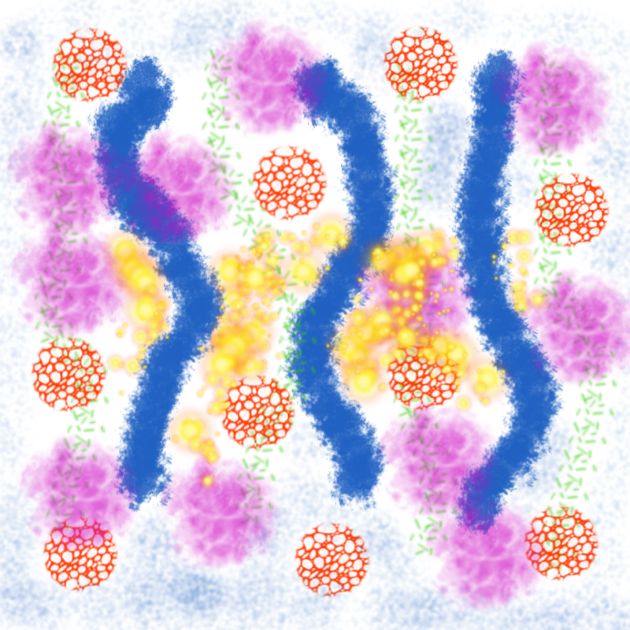

# Práctica 01 - Herramientas de pintura

En esta práctica dibujaréis empleando varios tipos de brocha y emplearéis la herramienta aerógrafo para crear una imagen similar a
la mostrada.
* Abrir un archivo nuevo de 800 x 800 píxeles, tipo RGB y con relleno con color blanco.
	* Seleccionar la herramienta brocha.
	* Seleccionar el pincel Acrylic 01 (tamaño 100, color azul) y dibujar algunas líneas onduladas verticales.
	* Seleccionar el pincel Confetti (tamaño 50, color verde) y dibujar algunas líneas onduladas verticales.
	* Seleccionar el pincel Cell 02 (tamaño 100, color rojo) y dibujar varios puntos.
	* Seleccionar el pincel Smoke (tamaño 170, color rosa fucsia) y dibujar varios puntos.
	* Seleccionar el pincel Sparks (tamaño 170, color amarillo) y dibujar varios puntos variando el tamaño de éstos.
* Seleccionar la herramienta Aerógrafo ,
	* Seleccionar el pincel Galaxy Small (AP), tamaño 80 y color azul, y rellena algunas zonas en blanco. Ten cuidado, ya que con el aerógrafo, cuánto más tiempo dejes pulsado el ratón sobre una mismoa zona con elVerás que cuanto más tiempo dejes pulsado el ratón sobre una misma zona más cantidad de pintura añadirás sobre dicha zona.
* Guarda la imagen creada como Práctica_GIMP_01.jpg y como Práctica_GIMP_01.png .
* Subir a Google Drive los archivos creados en esta práctica en una nueva carpeta (Práctica 01).
	* Nota. En tu Google Drive, ten un directorio para TIC y dentro de este, otro directorio para este tema de "Edición de imágenes".

## Un ejemplo de imagen a crear

## Reconocimiento

Práctica obtenida de http://pelandintecno.blogspot.com/.
Se ha modificado el formato para adaptarlo a Github.
